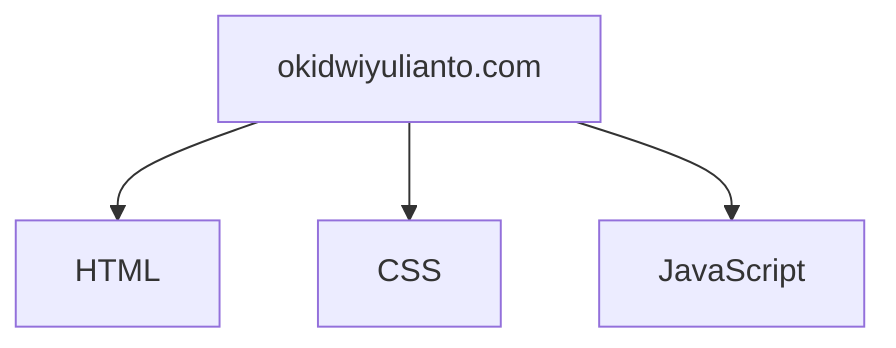

# 🚀 okidwiyulianto.com - Behind The Scenes
Welcome to the backbone of my personal website! This repository contains all the code, configurations, and secrets that power [okidwiyulianto.com](https://okidwiyulianto.com).
# 🔍 What's Inside?
Nothing, it just simple technologies built with HTML, CSS, and JavaScript. I used to Github as my personal website, and now I used Blogger as my personal website. For theme that I am using now, you can download in this repo also.
# 🛠️ Tech Stack

# 🏗️ Local Development
```bash
git clone https://github.com/okidwiyulianto/website.git
cd website
```
# 🤝 Contributing
While this is my personal site, I welcome constructive feedback! Please open an issue before submitting PRs.
# 📜 License
MIT © [OKI DWI YULIANTO](https://okidwiyulianto.com)
